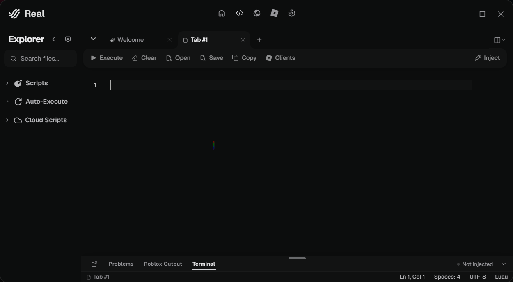

# ⚡ REAL EXECUTOR

  
  <h3>Powerful. Fast. Simple.</h3>

  

    A modern executor with a clean interface, 
    smooth animations and a simple user experience.
  

   

  

  
  

---

## ✨ About

**Real Executor** is a modern and lightweight executor focused on performance, simplicity and a clean user interface.

Built with a responsive design, smooth animations and an easy-to-use experience.

---

## 📥 Download

Download the latest version here:

---

## 🖼️ Preview

---

## 🛠️ Built With

---

**⚡ REAL EXECUTOR**

Built with passion.

